#### Git原理以及使用详解
> **Git详解**
>>[*Git Principles*](Git%20Principles.md)


#### 同步操作过程

打开浏览器登录到GitHub网址：https://github.com/

1. 注册账号（如有账号则可不用注册账号）并直接创建repo
		1. 创建远程new repo  
				   1.1 登录到home页面  
					   - home页面如下：  
					       
					   - 找不到的话可以点击左上角的三条横杠  
					       
					   - 点击后可以看到菜单，在菜单中点击home跳转到home页面  
					       
				  1.2. 创建 new repo  
					  - 点击红框的两个按钮都可以进行仓库的创建  
						  
					  - 在创建GitHub新仓库时，图中涉及的参数和选项的详细说明如下：  
						  
							1.  **General**      
								   - **Repository name（仓库名称）**: 这是您为新仓库选择的名称。这个名称需要是唯一的，并且简洁易记。命名时避免空格和特殊字符，保持简洁与可识别性。  
								   - **Description（描述）**: 这个字段是可选的，您可以添加一个简短的描述，帮助其他人理解这个仓库的用途。虽然可以不写，但建议添加，特别是在开源项目中，简洁的描述有助于别人快速了解项目内容。  
							 2. **Configuration（配置）**  
								- **Choose visibility（选择可见性）**: 选择仓库的可见性，通常有两个选项：  
								  - **Public（公开）**: 任何人都可以看到该仓库，包括搜索引擎。  
								  - **Private（私密）**: 只有你和你授权的人才能访问这个仓库。适用于需要隐私保护的项目。  
								- **Add README（添加README文件）**: 这个选项决定是否在仓库中添加一个README文件。README文件通常包含关于仓库的详细说明。建议勾选此项，它可以帮助访问者了解该仓库的内容和使用方法。  
								  - **On（启用）**: 添加README文件。  
								  - **Off（禁用）**: 不添加README文件。  
								- **Add .gitignore（添加.gitignore文件）**: 这个选项是决定是否添加一个.gitignore文件。gitignore文件用于列出那些应该被Git忽略、不提交的文件，如临时文件、编译文件等。  
								  - **No .gitignore（无.gitignore文件）**: 不添加此文件。  
								  - **选择模板（如：Python, Node等）**: 根据项目需求选择合适的.gitignore模板。  
								- **Add license（添加许可证）**: 这个选项决定是否为仓库选择许可证。许可证定义了别人如何使用你的代码。常见的开源许可证包括MIT许可证、GPL等。  
								  - **No license（无许可证）**: 不添加任何许可证。  
								  - **选择许可证**: 根据项目的开放程度选择合适的许可证。  
							3. **Create repository（创建仓库）**: 完成以上配置后，点击此按钮即可创建新的GitHub仓库。  
							   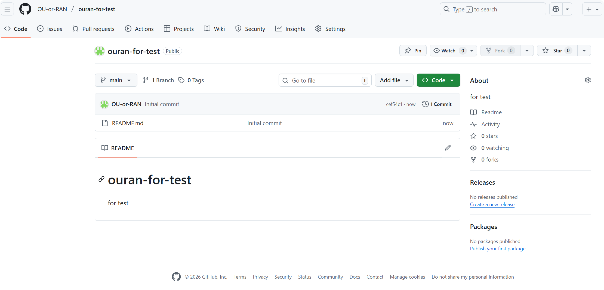  
		2. 创建本地new repo  
			      2.1 创建本地repo文件夹，这里我选择在Obsidian的vaults文件夹下创建“ouorranForTest”文件夹  
				      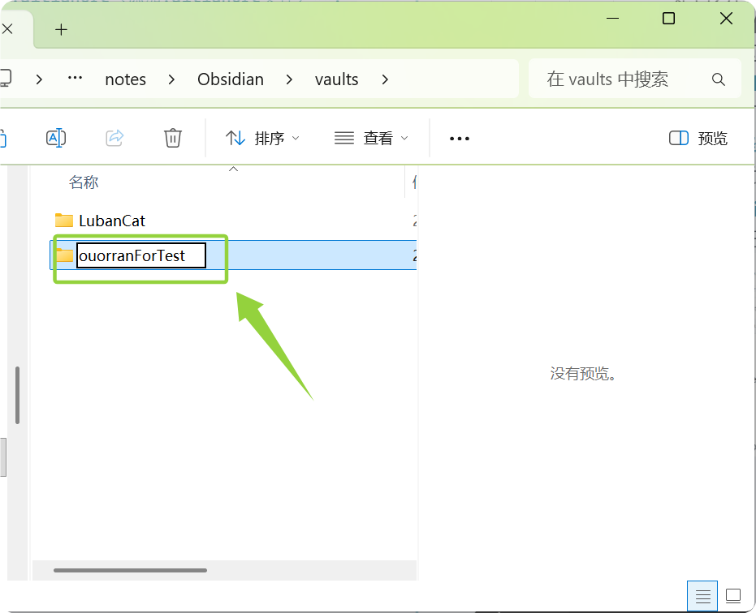   
			      2.2 在此文件夹下打开Git Bash终端  
				      - 进入到“ouorranForTest”文件夹下右键，点击**显示更多选项**  
				        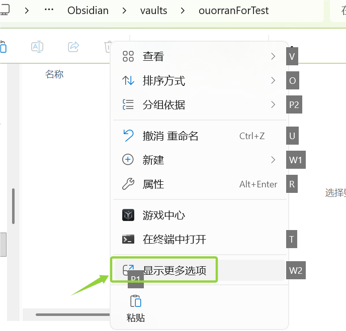  
				      - 点击**Open Git Bash here**，打开Git Bash终端   
				          
				  2.3 使用Git命令初始化本地repo  
				      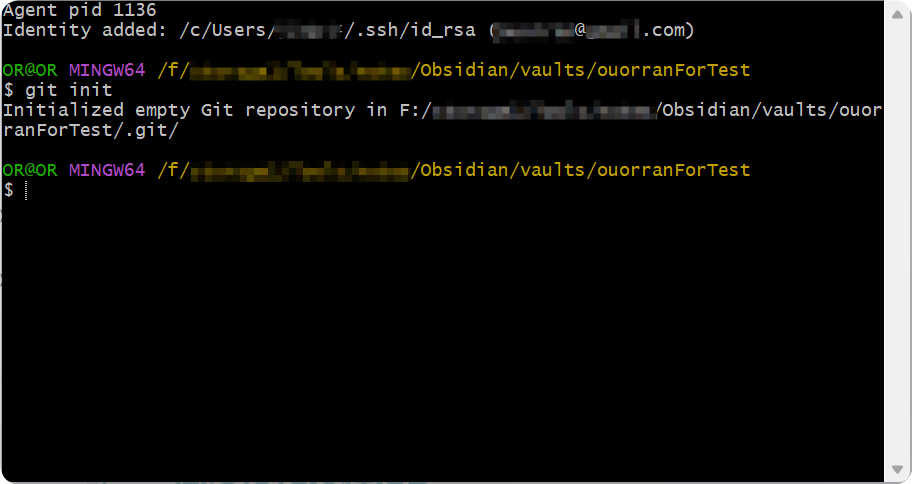    
				      至此，本地repo就已经创建完成了。  
2. 绑定远程repo与本地repo（**ssh方式**）    
		 - 点击GitHub头像，然后点击“setting”    
		   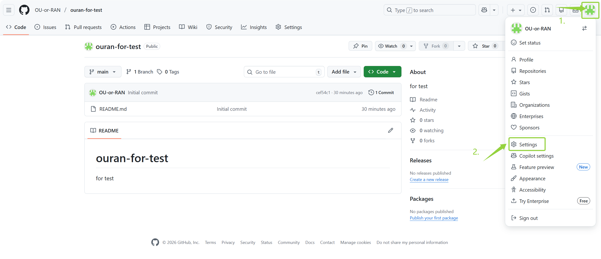  
		 - 跳转到写一个页面后点击左侧侧边栏的“SSH and GPG keys”    
		     
		 - 页面跳转后点击按钮“new SSH key”    
		   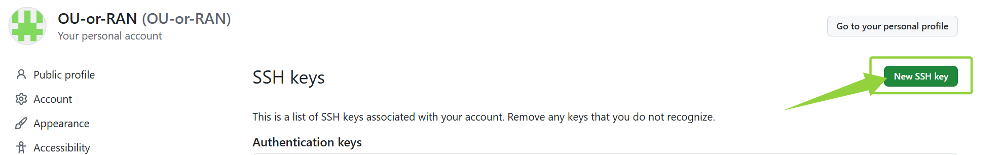  
		 - 设置key的标题，可以为电脑名也可以为项目名，根据自己需求设定，如何获得第二步的密钥呢？请参考以下步骤  
		   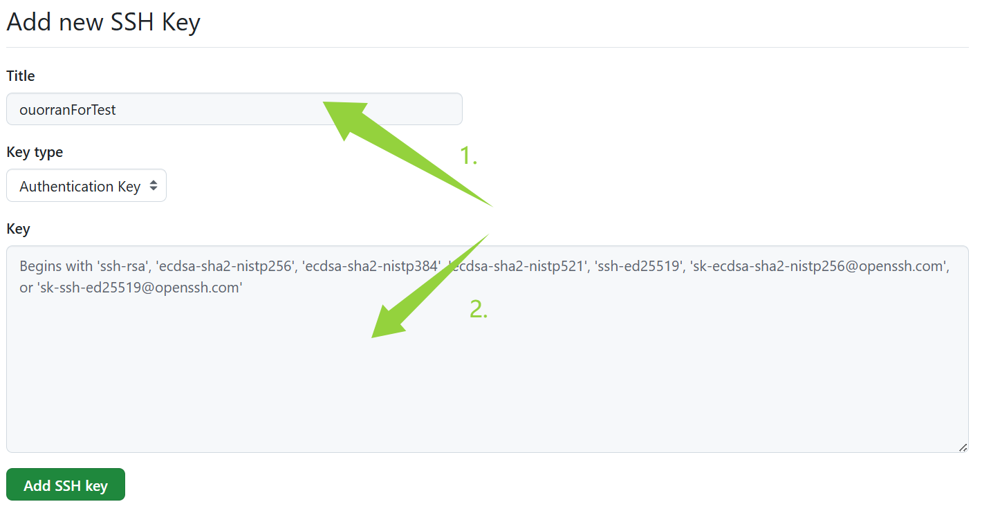  
		   - 打开Git Bash， 输入以下命令创建密钥并一直回车：    
			 `ssh-keygen -t ed25519 -C “your_email@example.com”`
			   或者（区别只在使用了不同的加密算法ed25519/RSA）  
			 `ssh-keygen -t rsa -C “your_email@example.com”`
			 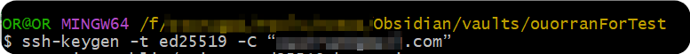  
		   - 注意公钥存储路径，看到randomart image出现说明创建成功了，这里测试我使用的是RSA  
			 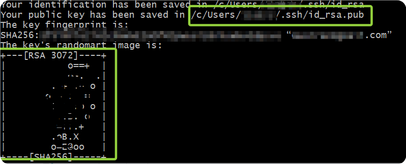  
		 - 进入公钥存储目录，打开**.pub**文件，并复制文件内容，这就是创建GitHub SSH key需要的公钥。    
		 - 回到GitHub创建SSH key页面，粘贴**.pub**文件内容点击“Add SSH key”后，再通过账户验证即可  
		   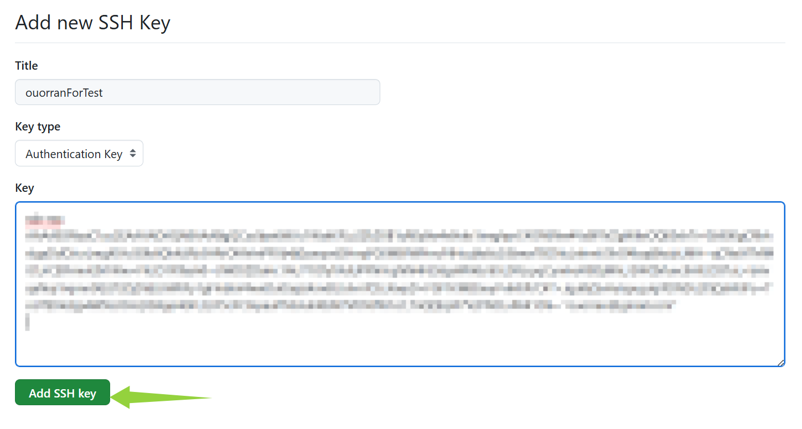  
		 - 创建成功  
		   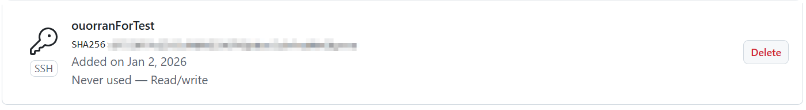  
		 - 回到刚刚创建的远程仓库ouorran-for-test，点击“Code”，复制SSH链接（**要从HTTPS链接切换到SSH链接**）  
		   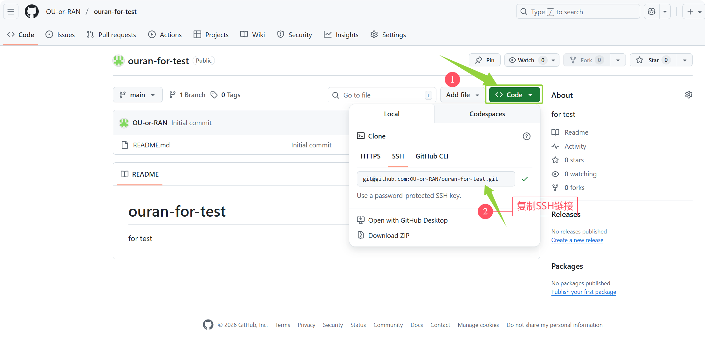  
		 - 回到Git Bash,输入以下命令并回车：  
		   `git remote add origin "远程仓库的SSH链接"`
		 - 如果出现以下报错，直接复制粘贴终端给出的命令后回车即可，这个问题是**系统不信任本地仓库所在位置**而引起的，该命令就是将本地仓库所在目录标记为安全，标记成功后即解决。  
		   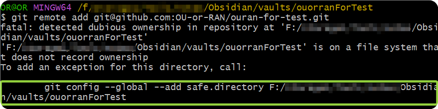  
		 - 连接成功  
		   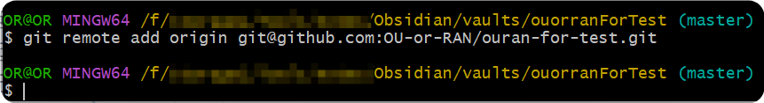  
3. 测试  
		  1. 输入以下命令检查是否连接成功：  
			 `ssh -T git@github.com`
			 如输出以下内容则成功：  
			 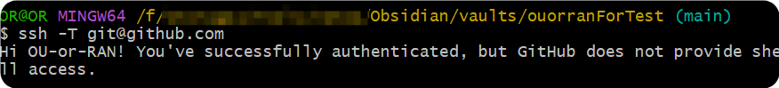  
		  2. 在本地仓库目录下创建test.txt文本文件  
			 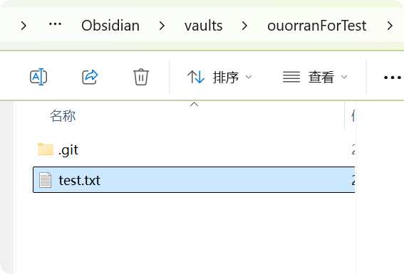  
		  3. 输入内容  
			   
		  4. Git Bash中依次输入以下命令并逐个回车  
			 ```Git Bash
			 git add .
			 git commit -m "the 1st push test"
			 git push -u origin main --force(如有添加README文件加上--force参数强制将本地repo同步至远程)
			 ```
		  5. 查看远程仓库，可以看到推送成功  
			   
		  6. 远程repo上编辑修改并提交test.txt文件：  
			 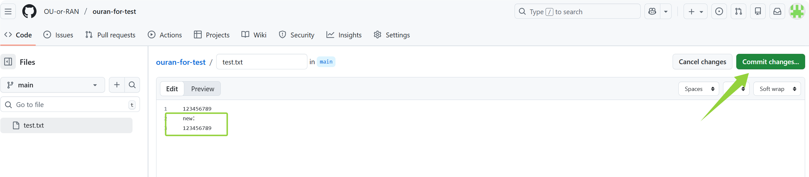  
		  7. Git Bash输入以下命令并回车：  
			 `git pull`
			 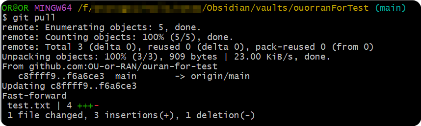  
		  8. 本地仓库打开test.txt文件，可以看到同步成功：  
			 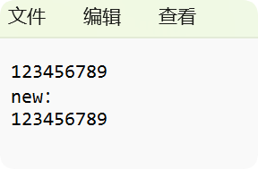  
			 
##### ⚠️ **常见问题与处理**

|问题|解决方案|
|---|---|
|**提示 `error: remote origin already exists`**|表示已关联过远程仓库，可先执行 `git remote -v` 查看。若需重置，运行：`git remote remove origin`，再重新关联。|
|**本地主分支叫 `master`，远程是 `main`**|推送时需指定分支映射：`git push -u origin master:main`|
|**提示 `failed to push some refs`**|通常因远仓库有本地没有的文件（如初始化的README）。先执行：`git pull origin main --allow-unrelated-histories` 合并，再 `git push`。|
|**推送时提示权限错误**|**HTTPS方式**：检查访问令牌是否正确。  <br>**SSH方式**：运行 `ssh -T git@github.com` 测试连接。|

#### 同步操作过程log

这是**Git 2.35+的安全机制**：
当仓库位于【文件系统不记录所有者】或【当前用户与目录属主不一致】时，就会报：
>[!failure]
>`fatal: detected dubious ownership in repository at 'F:/storage~~~~~~'` 

在Windows /外置硬盘/WSL/网络盘/同步盘（如OneDrive、Obsidian Vault）种很常见

>**如何忽略上传一个文件夹内的内容？**
>**注意ignore文件中的文件名不要带有空格**

>[!example]
>Daily Notes && DailyNotes
>>- 前一个文件名写进gitignore后该文件夹还是被上传至了github
>>- 后一个成功被忽略

>[!question]
>**如何使得MD内的图片内容可以被displayed在github或其他上面而非以链接形式展现？**
>
>这里需要使用MD的标准链接语法而非WikiLink语法
>>>*[外部链接（标准MD链接语法）](../MD%20Grammar/MD%20Grammar.md#^1510c4)*
>
>**如何通过Obsidian来commit、push、pull等git操作？**
>
>这里涉及到ssh连接是否成功的问题，你出现问题的本质原因在于你**重启Git bash**后，**触发了Git环境刷新**，这使得之前找不到的.ssh文件现在可以找到了(*路径解析成功*)，因此.ssh中的key可以成功被找到，从而能够通过GitHub身份认证而成功连接。
>
>>>*[什么操作会触发 Git 环境刷新，如何查看 SSH 使用的真实路径](../study%20log/Git%20Sync/SSH查找.ssh标准流程.md)*

因为之前成功建立了ssh链接，所以一直使用的时之前的ssh权限

>**variables**：
>>- if characters in path name is invalid
>>- if the path can be found successfully 

