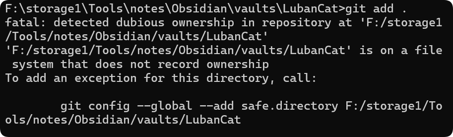

这是**Git 2.35+的安全机制**：
当仓库位于【文件系统不记录所有者】或【当前用户与目录属主不一致】时，就会报：
>[!failure]
>`fatal: detected dubious ownership in repository at 'F:/storage~~~~~~'` 

在Windows /外置硬盘/WSL/网络盘/同步盘（如OneDrive、Obsidian Vault）种很常见

>**如何忽略上传一个文件夹内的内容？**

>**注意ignore文件中的文件名不要带有空格**

>[!example]
>Daily Notes && DailyNotes
>>前一个文件名写进gitignore后该文件夹还是被上传至了github
>>后一个成功被忽略

>[!question]
>**如何使得MD内的图片内容可以被displayed在github或其他上面而非以链接形式展现？**

>[!question]
>**如何通过Obsidian来commit、push、pull等git操作？**

因为之前成功建立了ssh链接，所以一直使用的时之前的ssh权限

reload
>variables：
>>if characters in path name is invalid
>>if the path can be found successfully 