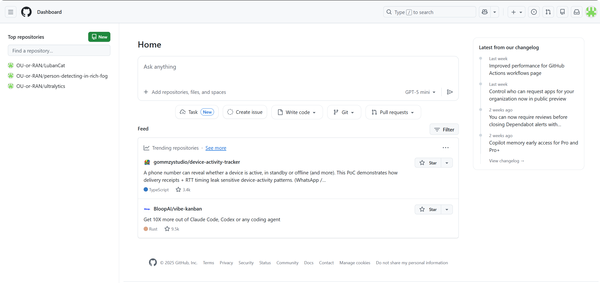
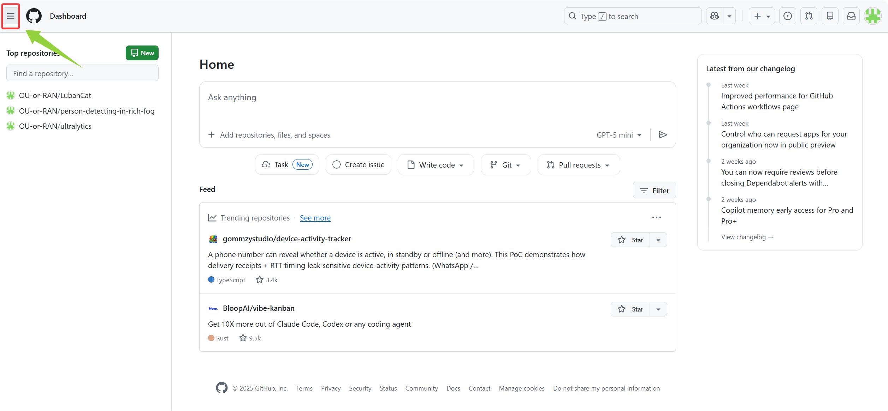
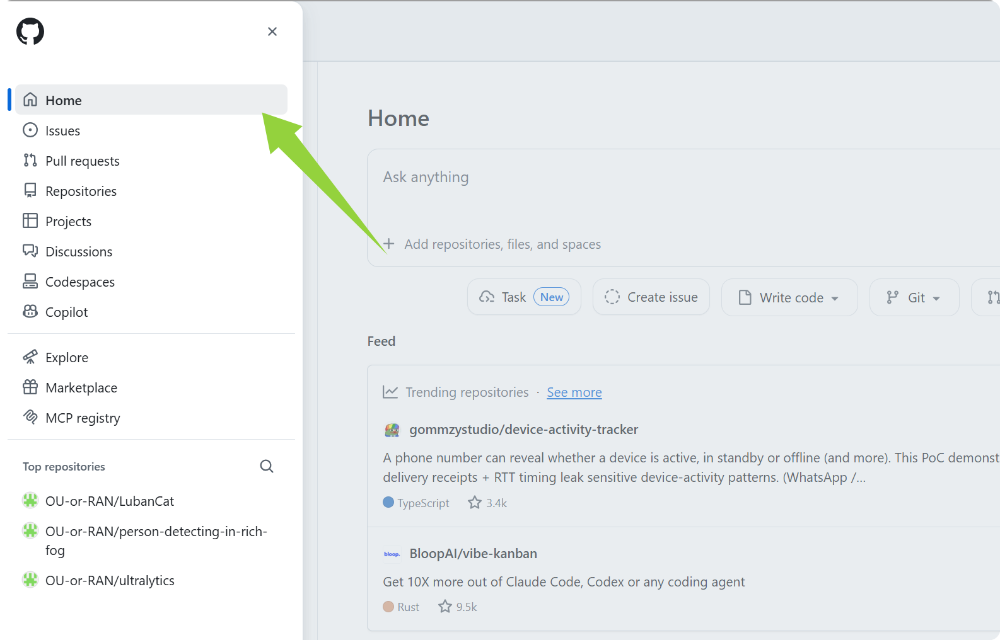

#### Git原理以及使用详解
> **Git详解**
>>[*Git Principles*](Git%20Principles.md)

#### 1. 创建远程Repository

打开浏览器登录到GitHub网址：https://github.com/

1. 注册账号（如有账号则可不用注册账号）并直接创建repo
	1. 创建new repo
	   1.1 登录到home页面
	   - home页面如下：
	     
	   - 找不到的话可以点击左上角的三条横杠
	     
	   - 点击后可以看到菜单，在菜单中点击home跳转到home页面
	     

	  1.2. 创建 new repo

		  - 点击红框的两个按钮都可以进行仓库的创建
		    
		  - 在创建GitHub新仓库时，图中涉及的参数和选项的详细说明如下：
		    
		    1.  **General**
		       
			       - **Repository name（仓库名称）**: 这是您为新仓库选择的名称。这个名称需要是唯一的，并且简洁易记。命名时避免空格和特殊字符，保持简洁与可识别性。
			       - **Description（描述）**: 这个字段是可选的，您可以添加一个简短的描述，帮助其他人理解这个仓库的用途。虽然可以不写，但建议添加，特别是在开源项目中，简洁的描述有助于别人快速了解项目内容。
			 2. **Configuration（配置）**
			    - **Choose visibility（选择可见性）**: 选择仓库的可见性，通常有两个选项：
			      
			      - **Public（公开）**: 任何人都可以看到该仓库，包括搜索引擎。
			      - **Private（私密）**: 只有你和你授权的人才能访问这个仓库。适用于需要隐私保护的项目。
				- **Add README（添加README文件）**: 这个选项决定是否在仓库中添加一个README文件。README文件通常包含关于仓库的详细说明。建议勾选此项，它可以帮助访问者了解该仓库的内容和使用方法。
				  - **On（启用）**: 添加README文件。
					- **Off（禁用）**: 不添加README文件。
				- **Add .gitignore（添加.gitignore文件）**: 这个选项是决定是否添加一个.gitignore文件。gitignore文件用于列出那些应该被Git忽略、不提交的文件，如临时文件、编译文件等。
				  - **No .gitignore（无.gitignore文件）**: 不添加此文件。
				  - **选择模板（如：Python, Node等）**: 根据项目需求选择合适的.gitignore模板。
				- **Add license（添加许可证）**: 这个选项决定是否为仓库选择许可证。许可证定义了别人如何使用你的代码。常见的开源许可证包括MIT许可证、GPL等。
				  - **No license（无许可证）**: 不添加任何许可证。
				  - **选择许可证**: 根据项目的开放程度选择合适的许可证。
			3. **Create repository（创建仓库）**: 完成以上配置后，点击此按钮即可创建新的GitHub仓库。
   1. 

#### 同步操作过程log

这是**Git 2.35+的安全机制**：
当仓库位于【文件系统不记录所有者】或【当前用户与目录属主不一致】时，就会报：
>[!failure]
>`fatal: detected dubious ownership in repository at 'F:/storage~~~~~~'` 

在Windows /外置硬盘/WSL/网络盘/同步盘（如OneDrive、Obsidian Vault）种很常见

>**如何忽略上传一个文件夹内的内容？**
>**注意ignore文件中的文件名不要带有空格**

>[!example]
>Daily Notes && DailyNotes
>>- 前一个文件名写进gitignore后该文件夹还是被上传至了github
>>- 后一个成功被忽略

>[!question]
>**如何使得MD内的图片内容可以被displayed在github或其他上面而非以链接形式展现？**
>
>这里需要使用MD的标准链接语法而非WikiLink语法
>>>*[外部链接（标准MD链接语法）](../MD%20Grammar/MD%20Grammar.md#^1510c4)*
>
>**如何通过Obsidian来commit、push、pull等git操作？**
>
>这里涉及到ssh连接是否成功的问题，你出现问题的本质原因在于你**重启Git bash**后，**触发了Git环境刷新**，这使得之前找不到的.ssh文件现在可以找到了(*路径解析成功*)，因此.ssh中的key可以成功被找到，从而能够通过GitHub身份认证而成功连接。
>
>>>*[什么操作会触发 Git 环境刷新，如何查看 SSH 使用的真实路径](../study%20log/Git%20Sync/SSH查找.ssh标准流程.md)*

因为之前成功建立了ssh链接，所以一直使用的时之前的ssh权限

>**variables**：
>>- if characters in path name is invalid
>>- if the path can be found successfully 

